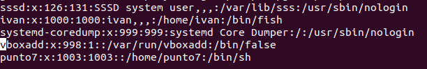

# Ejercicio 2

- [Ejercicio 2](#ejercicio-2)
- [Resumen "/etc"](#resumen-etc)
  - [1.0 Descripción do cometido do ficheiro ```/etc/passwd```](#10-descripción-do-cometido-do-ficheiro-etcpasswd)
  - [1.1 Estructura /etc/passwd](#11-estructura-etcpasswd)
  - [1.2 Formato /etc/passwd](#12-formato-etcpasswd)
  - [1.3 Relacion ```chsh -s```](#13-relacion-chsh--s)
- [2.0 Descripción do cometido /etc/shadow](#20-descripción-do-cometido-etcshadow)
  - [2.1 Relación ```chsh -s```](#21-relación-chsh--s)
- [3.0 Comando ```useradd```](#30-comando-useradd)
  - [3.1 Captura ```/etc/passwd```](#31-captura-etcpasswd)
  - [3.2 Captura ```/etc/shadow```](#32-captura-etcshadow)
- [4.0 Creación de una contraseña para nuestro usuario.](#40-creación-de-una-contraseña-para-nuestro-usuario)
  - [4.1 Cambios en ```/etc/passwd```](#41-cambios-en-etcpasswd)
  - [4.2 Cambios en ```/etc/shadow```](#42-cambios-en-etcshadow)
- [5.0 Observación ```ls -l /home```](#50-observación-ls--l-home)
  - [5.1 Captura ```/etc/passwd```](#51-captura-etcpasswd)
  - [5.2 Captura ```/etc/shadow```](#52-captura-etcshadow)
- [6.0 Elimina o usuario creado no punto 4 con userdel sen flags.](#60-elimina-o-usuario-creado-no-punto-4-con-userdel-sen-flags)
  - [6.1 Captura resultado ```ls -l /home```](#61-captura-resultado-ls--l-home)
  - [6.2 Captura ```/etc/passwd```](#62-captura-etcpasswd)
  - [6.3 Captura ```/etc/shadow```](#63-captura-etcshadow)
- [7.0 Vuelve a crear el usuario del punto 3 con ```adduser```](#70-vuelve-a-crear-el-usuario-del-punto-3-con-adduser)
  - [7.1 Captura ```ls -l /home``` despues de ```adduser```](#71-captura-ls--l-home-despues-de-adduser)
  - [7.2 Captura ```/etc/passwd```](#72-captura-etcpasswd)
  - [7.3 Captura ```/etc/shadow```](#73-captura-etcshadow)
- [8.0 Elimina completamente el usuario creado en el punto 3 / punto 7 con ```userdel```.](#80-elimina-completamente-el-usuario-creado-en-el-punto-3--punto-7-con-userdel)
  - [8.1 captura ```ls -l /home```](#81-captura-ls--l-home)
- [9.0 ¿Que es ```/etc/skel```?](#90-que-es-etcskel)
- [10.0  Para que sirve el fichero ```/etc/group```](#100--para-que-sirve-el-fichero-etcgroup)
- [11.0 Creación de grupos e usuarios](#110-creación-de-grupos-e-usuarios)
  - [11.1 Captura ```/etc/group```](#111-captura-etcgroup)
  - [11.2 Captura ```/etc/passwd```](#112-captura-etcpasswd)
- [12.0 Eliminar usuarios de grupos](#120-eliminar-usuarios-de-grupos)
  - [12.1 Eliminacion de jean-luc-godard e andrei-tarkovsky del grupo directors.](#121-eliminacion-de-jean-luc-godard-e-andrei-tarkovsky-del-grupo-directors)

# Resumen "/etc"

· /etc/passwd Información de configuración sobre las cuentas de usuario del sistema.

· /etc/shadow Contraseñas de las cuentas de usuario

· /etc/group Información sobre los grupos del sistema.
## 1.0 Descripción do cometido do ficheiro ```/etc/passwd```

El contenido del fichero ```/etc/passwd``` determina quien puede acceder al sistema de manera legitima y que se puede hacer una vez dentro del sistema. Este fichero es la primera linea de defensa del sistema contra accesos no deseados. Debe de mantenerse escrupulosamente y libre de errores y fallos de seguridad. En el tenemos registrados las cuentas de usuarios, asi como las claves de accesos y privilegios.

## 1.1 Estructura /etc/passwd
/etc/passwd contiene una entrada por línea para cada usuario (cuenta de usuario) del sistema. Todos los campos están separados por un (:). Total de siete campos de la siguiente manera. En general, la entrada del archivo /etc/passwd tiene el siguiente aspecto:


## 1.2 Formato /etc/passwd

**1. Nombre de usuario:** se utiliza cuando el usuario inicia sesión. Debe tener entre 1 y 32 caracteres de longitud.

**2. Contraseña:** un carácter x indica que la contraseña cifrada se almacena en el archivo /etc/shadow. Tenga en cuenta que debe usar el comando passwd para calcular el hash de una contraseña escrita en la CLI o para almacenar / actualizar el hash de la contraseña en el archivo /etc/shadow.

**3. ID de usuario (UID):** a cada usuario se le debe asignar una ID de usuario (UID). El UID 0 (cero) está reservado para root y los UID 1-99 están reservados para otras cuentas predefinidas. El sistema reserva UID 100-999 adicionales para cuentas / grupos administrativos y del sistema.

**4. ID de grupo (GID):** la ID de grupo principal (almacenada en /etc/group file).

**5. Información de ID de usuario:** El campo de comentario. Le permite agregar información adicional sobre los usuarios, como el nombre completo del usuario, el número de teléfono, etc. Este campo se utiliza mediante un comando de dedo.

**6. Directorio de inicio:** La ruta absoluta al directorio en el que estará el usuario cuando inicie sesión. Si este directorio no existe, el directorio de usuarios se convierte en /.

**7. Comando/shell:** La ruta absoluta de un comando o shell (/bin/bash). Típicamente, esto es un caparazón. Tenga en cuenta que no tiene que ser un shell.

## 1.3 Relacion ```chsh -s```
Este comando nos permíte modificar la terminal de inicio del usuario desde ```/etc/passwd```.

***Ejemplo:***

-Antes


-Despues


# 2.0 Descripción do cometido /etc/shadow
El fichero /etc/shadow almacena las contraseñas de las cuentas de usuario. Se utiliza este fichero por seguridad. /etc/shadow es un archivo de texto que contiene información sobre las contraseñas de los usuarios del sistema. Es propiedad del usuario root y del grupo oculto y tiene 640 permisos (*El usuario propietario puede leer y escribir, el grupo puede leer el archivo y otros no pueden hacer nada*).

## 2.1 Relación ```chsh -s```
No tenemos ninguna relacion entre ```chsh -s``` e ```/etc/shadow``` ya que el shell se encuentra en ```/etc/passwd```, es decir, aún que ejecutemos el comando ```chsh -s``` no realizaremos cambios en el ```/etc/shadow```.

# 3.0 Comando ```useradd```

Con el comando ```useradd``` crearemos usuarios e para engadir un home escribiremos ```--create-home``` diante do nome de usuario.


## 3.1 Captura ```/etc/passwd```

En esta captura de ```/etc/passwd``` podemos ver la estructura del usuario que acabamos de crear.


## 3.2 Captura ```/etc/shadow```


# 4.0 Creación de una contraseña para nuestro usuario.

Para crear una contraseña usamos el comando ```passwd``` seguido del nombre de usuario al que le queremos poner la contraseña.


## 4.1 Cambios en ```/etc/passwd```


## 4.2 Cambios en ```/etc/shadow```

Como podemos ver al crear unha contraseña aparece codificada en ```/etc/shadow```.


# 5.0 Observación ```ls -l /home```

Antes:


Creamos el usuario **punto7**

Despues:


## 5.1 Captura ```/etc/passwd```

En la siguiente captura podemos ver la situación de ```/etc/passwd```


## 5.2 Captura ```/etc/shadow```

En la siguiente captura podemos ver la situación de ```/etc/shadow```


# 6.0 Elimina o usuario creado no punto 4 con userdel sen flags. 


## 6.1 Captura resultado ```ls -l /home```
Antes:


Despues:


## 6.2 Captura ```/etc/passwd```

Tras la ejecución podemos ver que el usuario no aparece en ```/etc/passwd```



## 6.3 Captura ```/etc/shadow```

Tras la ejecución podemos ver que el usuario no aparece en ```/etc/shadow```


# 7.0 Vuelve a crear el usuario del punto 3 con ```adduser```
Antes:


## 7.1 Captura ```ls -l /home``` despues de ```adduser```

Despues:


## 7.2 Captura ```/etc/passwd```


## 7.3 Captura ```/etc/shadow```


# 8.0 Elimina completamente el usuario creado en el punto 3 / punto 7 con ```userdel```.


## 8.1 captura ```ls -l /home```

Antes:


Despues:


# 9.0 ¿Que es ```/etc/skel```?

Es bastante simple de configurar y usar. Proporciona una forma de estar seguro de que todos los nuevos usuarios de tu sistema LFS tienen la misma configuración inicial. El directorio ```/etc/skel``` es usado por el programa /usr/sbin/useradd.


# 10.0  Para que sirve el fichero ```/etc/group```

Contiene los nombres de los grupos y una lisa de los usuarios que pertenecen a cada grupo. Cada línea representa un grupo y contiene 4 campos:

```
El nombre del grupo (es recomendable que no tenga más de 8 caracteres).
La contraseña cifrada o bien una x que indica la existencia de un archivo gshadow.
Le número de GID
Lista de los miembros del grupo, separados por comas (sin espacios)
```


# 11.0 Creación de grupos e usuarios


## 11.1 Captura ```/etc/group```


Podemos ver la creacion del propio grupo, y los usuarios añadidos. 

## 11.2 Captura ```/etc/passwd```


Aparte de la creacion de los usuarios, vemos que estes tienen el grupo, el cual hemos creado y le hemos añadido a esos tres usuarios.

# 12.0 Eliminar usuarios de grupos

Para eliminar al usuario de uno de esos grupos, usaremos el comando ```gpasswd``` con el ```–Eliminar bandera``` seguido por el usuario que se eliminará y el grupo.
```
sudo gpasswd --delete [nombre usuario] [nombre grupo]
```

## 12.1 Eliminacion de jean-luc-godard e andrei-tarkovsky del grupo directors.
Ejemplos:
```
sudo gpasswd --delete jean-luc-godard directors
sudo gpasswd --delete andrei-tarkovsky directors
```
