# Definiciones:
EFI: son las siglas de Extensible Firmware Interface y es un estándar que pretende sustituir a la BIOS, el sistema de arranque que se ha venido utilizando en los PCs desde sus inicios. El sistema EFI utiliza varios sensores para detectar el estado del motor y el estado del vehculo en marcha. Y la ECU del motor calcula el volumen de inyeccin de combustible ptimo y provoca que los inyectores lo inyecten.

UEFI: es el acrónimo de "Unified Extensible Firmware Interface" o "Interfaz de Firmware Extensible Unificada". Es el firmware sucesor, escrito en C, del BIOS, sistema al que empezó a suceder a partir del año 2005, 30 años después del nacimiento de la BIOS.

BIOS: La BIOS pone las funciones básicas de un ordenador a disposición del usuario. Al encenderlo, comprueba si las partes más importantes son funcionales, como la memoria, la CPU y otros componentes de hardware. Esta prueba se denomina autoprueba de arranque o power on self test (POST).

GPT: La tabla de partición GUID (GPT) es un nuevo estilo de partición que forma parte de la especificación de interfaz de firmware extensible unificada (UEFI). Esto se utiliza para instalaciones de fábrica con Windows 8, 8.1 y 10 para mayor flexibilidad de partición y más funciones avanzadas de Windows.

MBR: o master boot recordes el primer sector físico de un portador de datos (por ejemplo, un disco duro, una memoria USB) que se utiliza para arrancar (iniciar) los ordenadores. Para esto, el ordenador debe disponer de un BIOS y un sistema operativo x86.

GUID: El identificador único global, en inglés: globally unique identifier (GUID) es un número pseudoaleatorio empleado en aplicaciones de software. El GUID es una implementación de Microsoft de un estándar llamado universally unique identifier (UUID), especificado por la Open Software Foundation (OSF).

UUID:Son las siglas de Universally Unique IDentifier, que en inglés significa, literalmente, 'identificador único universal'. Como tal, el UUID es un código identificador estándar empleado en el proceso de construcción de software.

# 1. Create and Configure a Virtual Machine

## 1.1 Creation
Vamos a crear una maquina Arch, para eso seguiremos estos pasos en VirtualBox:

Paso 1: Insertar un nombre para la maquina, sistema operativo y versión del sistema operativo:

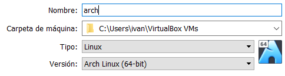

Paso 2: Seleccionar tamaña de la memoría RAM (en este paso dejaremos suficiente espacio para la maquina real).

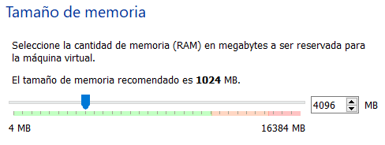

Paso 3: Indicaremos que queremos reservar el disco dinamicamente (Con esto evitaremos acaparar espacio del disco real que no contiene información).

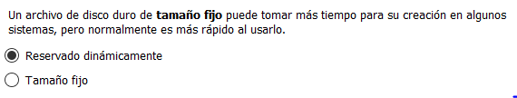

Paso 4: Seleccionaremos como formato de disco VDI.

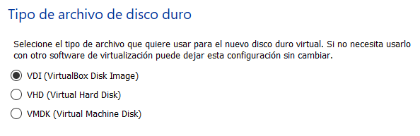

Paso 5: Selecionamremos el tamaño del disco duro que necesitamos.

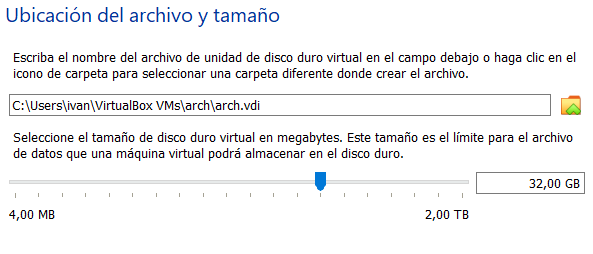

## 1.2 Extra Configuration

Unha vez tenemos la maquina creada en VirtualBox tendremos que configurar sus parametros y insertar la ISO de instalación.

Paso 1: Seleccionamos los núcleos del procesador real que queremos usar para la maquina virtual.

 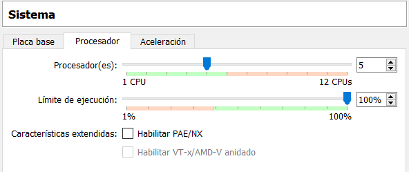

Paso 2: Aumentamos a memoria de vídeo al maximo permitido y cambiaremos el controlador gráfico por VBoxSVGA.

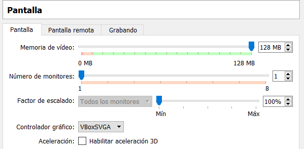

Paso 3: Insertamos la ISO en el apartado almacenamiento.

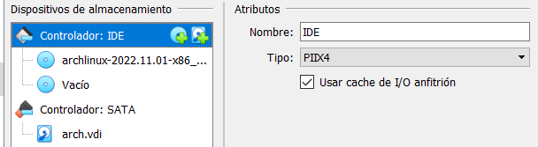

Paso 4: Cambiamos la configuración de red a Adaptador puente.
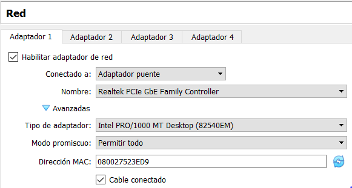

## 1.3 Configuración del teclado
Al iniciar la máquina, nos encontraremos dentro de la ISO de instalacin, donde recoge algunos recursos para instalar el SO.

El problema que tendremos es que tendremos el teclado estara en una distrubucion que no es la española, para cambiarlo usaremos el comando:
```
loadkeys es
```

## 1.4 Intalación y configuración SSH
Lo siguiente que haremos, sera instalar el ```openssh```, para que la instalacion se dificulte lo menos posible, y podamos copiar los comandos, y reflector nos servira para que la lista de servidores de replica estea actualizada.

```
pacman -Syy reflector openssh
```
Y lo iniciaremos:

```
systemctl start sshd
```

Ahora, miraremos la ip de la máquina, ya que necesitaremos su IP para realizar el ssh:
```
ip a
```

Ahora, estableceremos una contraseña para root, para el ssh, y evitar editar ficheros:
```
passwd root
```

Abriremos un terminal (en mi caso PuTTY), y pondremos el comando para realizar el ssh como root, en este caso usaremos root, ya que no tenemos un usuario creado:
```
ssh root@[ip de la maquina]10.0.8.99
```

Esto nos permitira conectarnos remotamente a la máquina, lo cual nos facilitara la instalacion.

## 1.5 Timedatectl
A continuación, miraremos si el reloj esta sincronizado (por lo general no lo esta):
```
timedatectl set-ntp true
```

## 1.6 Refrescar servidores
Ahora, refrescaremos los servidores con ```reflector```
```
reflector -c Spain -a 10 --sort rate --save /etc/pacman.d/mirrorlist
```

## 1.7 Particionar discos con ```lsblk```
Antes de particionar, debemos ver los discos que tenemos, el comando para ello es:
```
lsblk
```

## 1.8 Crear particiones con ```gdisk```
Ahora crearemos las particiones con gdisk, para ello usaremos el siguiente comando, donde elegiremos el tipo de particion, que será EFI, en ese menu sera ef00:
```
gdisk /dev/sda
```


Como se pode ver na captura anterior faremos duas particions:
Partición 1:
```
-Partition number: 1 (indicamos que estamos creando la partición 1).
-First sector: (Indicamos el sector no que comezará la partición, en este caso seleccionamos el sector por defecto).
-Last sector: (Como queremos crear otra partición indicamos que requerimos solo 200 MB)
Hex code or GUID: (Como queremos crear una partición EFI escribimos ef00)
```

Partición 2:
```
-Partition number: 1 (indicamos que estamos creando la partición 2).
-First sector: (Indicamos el sector en el que comezará la partición,  seleccionamos el sector por defecto).
-Last sector: (Como solo haremos dos particiónes indicaremos que ocupe el resto del discomo marcando o ultimo sector).
Hex code or GUID: (Indicaremos el codigo 8300 que se corresponde con Ubuntu).
```

## 1.9.1 Creación carpetas para montar particiones.
Primeiro debemos formatear las particiónes:

Formato partición 1:
```
mkfs.fat -F 32 /dev/sda1
```
Formatearemos a partición en FAT32

Formato partición 1:
```
mkfs.ext4 /dev/sda2
```
Formatearemos a partición en EXT4

### 1.9.2 Montar carpetas
Ahora montaremos las particiones 

Montaje partición 2:
```
mount /dev/sda2 /mnt 
```
Para montar la partición 1 precisamos crear la carpeta
```
mkdir -p /mnt/boot
```

Montaje partición 2:
```
mount /dev/sda1 /mnt/boot
```

Por ultimo haremos ```lsblk``` para confirmar que están bien montadas.

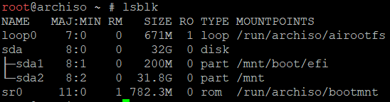

## 1.10 Instalar firmware de vim.
E instalaremos el firmware de linux y vim:
```
pacstrap /mnt base linux linux-firmware vim
```
## 1.11 Generar ```fstab```
Ahora generaremos el archivo fstab para quedefina las UUID de los discos:
```
genfstab -U /mnt  
```
```
/mnt/etc/fstab
```

# 2.0 Configuración del sistema operativo instalado
Ahora entraremos, al sistema operatvo que hemos instalado:
```
arch-chroot /mnt
```

## 2.1 Zona horaria

Una vez dentro estableceremos la zona horaria, para eso usaremos
```
ln -sf /usr/share/zoneinfo/Spain /etc/localtime
```
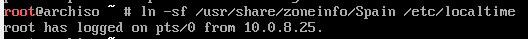

Ahora generaremos el fichero que contiene información descriptiva sobre el reloj del modo de hardware:
```
hwclock --systohc
```


## 2.1 Establecer idioma y distribución del teclado:
```
echo LANG=es_ES.UTF-8 /etc/locale.conf
echo KEYMAP=es /etc/vconsole.conf
```


## 2.2 Establecer nombre para la maquina desde Vim
Ahora creamos el archivo ```/etc/hostname``` y ```/etc/hosts``` estableceremos un nombre para la máquina:
```
vim /etc/hostname
```
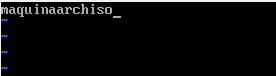

```
vim /etc/hosts
```
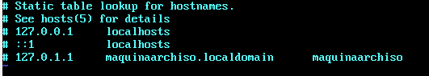


# 3.0 Instalación de utilidades en el SO
Instalaremos las utilidades utilidades que podemos ver en el comando:
```
pacman -Sy grub efibootmgr networkmanager network-manager-applet dialog os-prober mtools dosfstools base-devel linux-headers cups reflector openssh xdg-utils xdg-user-dirs virtualbox-guest-utils
```
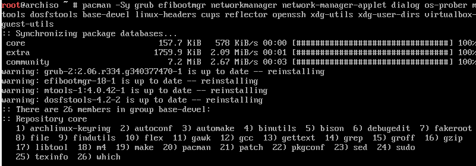

Ahora instalaremos y configuraremos grub:
```
grub-install

grub-mkconfig -o /boot/grub/grub.cfg
```
