- [1 Cal é o páquete que permite manexar cuotas?](#1-cal-é-o-páquete-que-permite-manexar-cuotas)
  - [2.1 Find](#21-find)
    - [2.1.1 Que é ```find```.](#211-que-é-find)
    - [2.1.2 Explicación flags ```-type``` e ```-name```](#212-explicación-flags--type-e--name)
    - [2.1.3 Exemplo de uso, `find` para confirmar que os modulos kernel de `quota` están instalados.](#213-exemplo-de-uso-find-para-confirmar-que-os-modulos-kernel-de-quota-están-instalados)
- [3 Onde debemos activar/declarar as cuotas de usuario e grupo](#3-onde-debemos-activardeclarar-as-cuotas-de-usuario-e-grupo)
  - [3.1 Debemos editar o ficheiro `/etc/fstab`](#31-debemos-editar-o-ficheiro-etcfstab)
  - [3.2 Posteriormente teremos que remontar o filesystem que modificamos.](#32-posteriormente-teremos-que-remontar-o-filesystem-que-modificamos)
  - [3.3 Ahora comprobaremos que as opcións de disco son correctas](#33-ahora-comprobaremos-que-as-opcións-de-disco-son-correctas)
- [4 Activando as cuotas (tanto de usuario coma de grupo)](#4-activando-as-cuotas-tanto-de-usuario-coma-de-grupo)
  - [4.1 Creación de ficheiros necesarios](#41-creación-de-ficheiros-necesarios)
  - [4.2 verificamos que se crearon os ficheiros adecuados](#42-verificamos-que-se-crearon-os-ficheiros-adecuados)
  - [4.3 Añadir modulos de quota al kernel.](#43-añadir-modulos-de-quota-al-kernel)
  - [4.3 Activa o sistema de cuotas](#43-activa-o-sistema-de-cuotas)
- [5 Cuotas de usuario e de grupo.](#5-cuotas-de-usuario-e-de-grupo)
  - [5.1 Creación usuarios con el comando `useradd`.](#51-creación-usuarios-con-el-comando-useradd)
  - [5.2 Creación de grupos con el comando `groupadd`.](#52-creación-de-grupos-con-el-comando-groupadd)
  - [5.3 Incluir *veronica-lake, gene-tierney e hedy-lamarr* no grupo *actresses* con el comando `sudo usermod`.](#53-incluir-veronica-lake-gene-tierney-e-hedy-lamarr-no-grupo-actresses-con-el-comando-sudo-usermod)
  - [5.3 Incluir *ada-lovelace* no grupo *scientists* con el comando `sudo usermod`.](#53-incluir-ada-lovelace-no-grupo-scientists-con-el-comando-sudo-usermod)
  - [5.4 Establecer cuotas de usuario](#54-establecer-cuotas-de-usuario)
    - [5.4.1 Engadir cuotas usuarios creados anteriormente.](#541-engadir-cuotas-usuarios-creados-anteriormente)
    - [5.4.2 Comprobación cuotas usuarios](#542-comprobación-cuotas-usuarios)
  - [5.5 Establecer cuotas de grupo](#55-establecer-cuotas-de-grupo)
    - [5.5.1 Engadir cuotas grupos creados anteriormente.](#551-engadir-cuotas-grupos-creados-anteriormente)
    - [5.5.2 Comprobación cuotas grupos](#552-comprobación-cuotas-grupos)
- [6.0 Efectos do solapamento das cuotas entre gupos e usuarios.](#60-efectos-do-solapamento-das-cuotas-entre-gupos-e-usuarios)
  - [6.1 Cómo funcionan as cuotas nun grupo?](#61-cómo-funcionan-as-cuotas-nun-grupo)
  - [6.2 Cómo afectan aos usuarios do grupo?](#62-cómo-afectan-aos-usuarios-do-grupo)
- [7.0 Informes de cuotas](#70-informes-de-cuotas)
# 1 Cal é o páquete que permite manexar cuotas?
O paquete para manexar cuotas denominase ```quota```, este non ven enstalado por defecto en ubuntu 22.04 ou anteriores. 

Para instalar o devandito paquete usaremos o seguinte comando:
```
sudo apt install quota
```


## 2.1 Find
O comando find ven instalado por defecto en Ubuntu 22.04 incluso na versión minima. Isto podemos comprobalo con ```which find```


### 2.1.1 Que é ```find```.

Find pode ser usado para encontrar arquivos en Linux, este inicia unha busqueda recursiva en unha xerarquía de directorios seguindo uns certos criterios.


### 2.1.2 Explicación flags ```-type``` e ```-name```

`-type` Permite filtrar según o tipo de arquivo.

Aquí podemos ver a forma de distinguir entre Arquivos, Directorios e Enlaces:

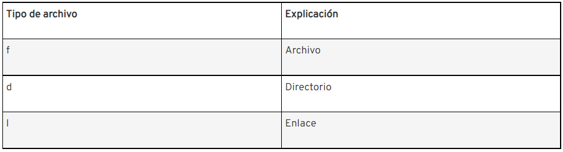

Exemplo de `-type`:
```
find . -type f
```

`-name` Para filtrar por nomes de archivo, utiliza el parámetro `-name`. Esto require un nome de arquivo exacto e distingue entre maiúsculas y minúsculas, para evitar que distinga entre maiúsculas e minusculas podemos engadir `-i` antes de `-name` e escribiríase `-iname`.

Exemplo de `-name`:
```
find . -name <File_Name>
```
Exemplo de `-iname` (Para que pase por alto as mayusculas):

```
find . -iname <File_Name>
```

### 2.1.3 Exemplo de uso, `find` para confirmar que os modulos kernel de `quota` están instalados.
Exemplo de busqueda con `-type` e `-name`  para buscar arquivos:
```
find <Ruta que queremos buscar> -type f name <File_Name>
```


Esta sería unha forma de saber se están instalados os módulos do kernel que permiten o manexo de cuotas con ```find```.

# 3 Onde debemos activar/declarar as cuotas de usuario e grupo

## 3.1 Debemos editar o ficheiro `/etc/fstab`

Editamos `/etc/fstab` para indicar cal dos sistemas de arquivos terá cuotas. Para iso engadimos `usrquota` e `grpquota`.

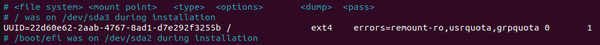

Como se pode ver na captura anterior  engadimos `usrquota` e `grpquota` na particion a cal engadiremos *cuotas*.

## 3.2 Posteriormente teremos que remontar o filesystem que modificamos.
Usaremnos o seguinte comando:
```
mount -vo remount < directorio donde está montado >
```


## 3.3 Ahora comprobaremos que as opcións de disco son correctas
Para iso miraremos os contido de `/proc/mounts`

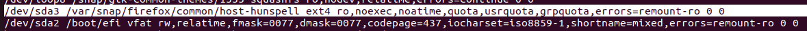

Como podemos ver a particion que editamos está montada correctamente.

# 4 Activando as cuotas (tanto de usuario coma de grupo)

## 4.1 Creación de ficheiros necesarios
Usaremos o comando `sudo quotacheck -ugm < directorio donde está montada a particion >` para crear os arquivos `aquota.user` e `aquota.group`.

Definición dos parámetros:
- `-u:` simboliza que se creará un arquivo de cuota basado no usuario chamado `aquota.user`
- `-g:` indica que se creará un arquivo de cuota basado en grupos chamado `aquota.group`
- `-m:` deshabilita o remontaxe do sistema de arquivos como de solo lectura e, ao mesmo tempo, brinda resultados precisos en un entorno no que o usuario sigue guardando archivos.

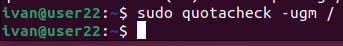

## 4.2 verificamos que se crearon os ficheiros adecuados
Usaremos `ls` seguido de `/` para confirmar que se crearon `aquota.user` e `aquota.group` neste ultimo directorio.

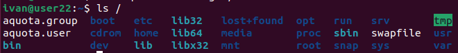

    Engade os módulos de quota ao kernel (se fose necesario)

## 4.3 Añadir modulos de quota al kernel.
Non sería necesario añadilos ao kernel pero en caso de que queiramos facerlo usaremos o comando.
```
sudo apt install linux-image-extra-virtual
```

Este paquete instala controladores adicionais que quedan fora do paquete básico del núcleo.

## 4.3 Activa o sistema de cuotas
En este momento las cuotas están desactivadas, para activarlas usaremos el comado.
```
sudo quotaon -v < directorio donde está montado >
```
Significado del flag:
- `-v` Imprimir mas informacion

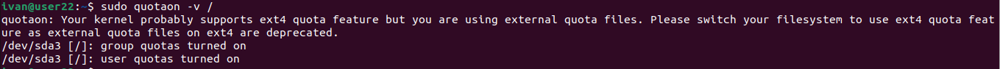

# 5 Cuotas de usuario e de grupo.

## 5.1 Creación usuarios con el comando `useradd`.
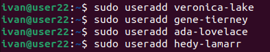

## 5.2 Creación de grupos con el comando `groupadd`.
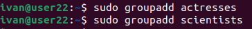

## 5.3 Incluir *veronica-lake, gene-tierney e hedy-lamarr* no grupo *actresses* con el comando `sudo usermod`.
```
sudo usermod -a -G <grupos> <usuario>
```
Flags:
- `-a `agregar el usuario a los grupos complementarios mencionados por la opción `-G` sin eliminar al usuario de otros grupos
- `-G`


## 5.3 Incluir *ada-lovelace* no grupo *scientists* con el comando `sudo usermod`.

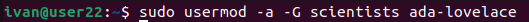

## 5.4 Establecer cuotas de usuario
Para establecer cuotas usamos o comando `edquota`
```
sudo edquota -u < nombre do usuario >
```
Ao introducir o devandito comando abrirase un editor de texto no cal introduciremos os parametros requeridos.

Flags:
- `-u` editar usuario

### 5.4.1 Engadir cuotas usuarios creados anteriormente.
veronica-lake 100M soft e 150M hard.
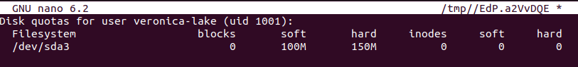

gene-tierney 200M soft e 250M hard.
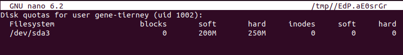

ada-lovelace 500M soft e 600M hard.
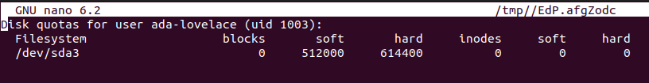

En este caso podese ver que ao salir e volver entrar os tamaños se mostran en bytes.

hedy-lamarr 800M soft e 1G hard.
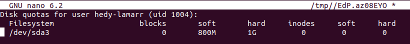

### 5.4.2 Comprobación cuotas usuarios
Para comprobar que as cuotas se crearon correctamente usaremos o comando `cuota` 
```
sudo quota -vs <Nome do usuario>
```
Flags:
- `-v` imprimir máis información
- `-s` mostrar unidades en (MB, GB...)


## 5.5 Establecer cuotas de grupo
Para establecer cuotas de grupo tamén usamos o comando `edquota`
```
sudo edquota -g < nombre do grupo >
```
Ao introducir o devandito comando abrirase un editor de texto no cal introduciremos os parametros requeridos.

Flags:
- -g editar grupo
  
### 5.5.1 Engadir cuotas grupos creados anteriormente.
actresses 400M soft e 450M hard
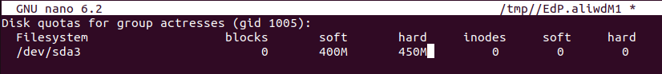

scientist 900M soft e 1G hard
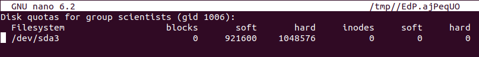

Como ocorre cos usuarios ainda que asignemos os tamaños en Mb se salimos e volvemos entrar ao arquivo o formato cambia.

### 5.5.2 Comprobación cuotas grupos 
Para comprobar que as cuotas se crearon correctamente volveremos usar o comando `cuota` 
```
sudo quota -vs <Nome do grupo>
```
Flags:
- `-v` imprimir máis información
- `-s` mostrar unidades en (MB, GB...)
- `-g` mostrar informacion de los grupos
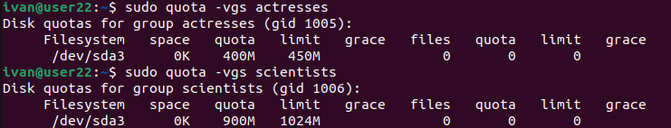


# 6.0 Efectos do solapamento das cuotas entre gupos e usuarios.

## 6.1 Cómo funcionan as cuotas nun grupo?

No caso dos grupos se asignamos 500Mb repartense entre os usuarios do grupo e a parte correspondetente sumase a cuota hard de cada usuario.

## 6.2 Cómo afectan aos usuarios do grupo?

 A cuota do grupo afecta aos membros do grupo (sumada)


# 7.0 Informes de cuotas

Xeraremos un informe global das cuotas creadas,usaremos o seguinte comando.
```
sudo repquota -vug /
```
Flags:
- `-v` mostrar también usuarios/grupos sin ningún uso
- `-u` mostrar informacion a cerca de usuarios
- `-g` mostrar informacion a cerca de grupos 
  
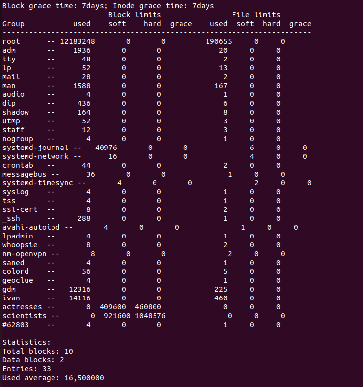

Informacion sacada de:

[quota](https://www.ionos.es/digitalguide/servidores/configuracion/comando-linux-find/?ac=OM.WE.WEo42K356300T7073a&itc=L0Q5C23R-FAC1E9-&utm_source=google&utm_medium=cpc&utm_campaign=SGE-ES-MYW-MIXX---PERFORMANCE_MAX---&utm_term=&matchtype=&utm_content=&gclid=Cj0KCQiA1NebBhDDARIsAANiDD2Ha4iug-nsyRkJS3evdKnyvsmIe5P9yECbvyjrNAHCsCLddfxeWQ8aAuwmEALw_wcB&gclsrc=aw.ds),
[quota2](http://apuntes.ucr.ac.cr/index.php/Crear_cuotas_de_espacio_para_usuarios_y_grupos),
[quota3](https://es.linux-console.net/?p=199#gsc.tab=0),
[kernel](https://askubuntu.com/questions/153023/what-is-the-linux-image-extra-package-for-and-do-i-need-it)
[grupos](https://serverfault.com/questions/327606/what-exactly-is-a-group-quota-filesystem)

# 1.0 Comprobación de cuotas 

Creamos dous escenarios, no primero creamos un usuario (u1) e un grupo (g1) engadimos cuotas aos usuarios e grupos, intentaremos saturar o grupo engadindo este como apendice. No segundo escenario creamos un usuario (u2) e un grupo (g2) engadimos cuotas aos usuarios e grupos, substituimos o grupo principal.

## 1.1 Primeiro esceario

### 1.1.1 Creamos os usuarios e grupos con:

```
sudo adduser -nome de usuario-
```


e o grupo con

```
sudo creategroup nome do grupo
```

### 1.1.2 Asignamos as cuotas ao usuario u1 usando
```
sudo edquota -vs nome do usuario
```
`-v` imprimir máis información.
`-s` mostrar unidades en (MB, GB...) é decir de forma legible para os humanos.


```
sudo edquota -vsg nome do grupo
```
`-v` imprimir máis información.
`-s` mostrar unidades en (MB, GB...) é decir de forma legible para os humanos.
`-g` para que afecte a grupos


### 1.1.3 Unha vez establecidas as cuotas asignaremos o grupo g1 como apendice de u1

 

 Ahora iremos ocupando as cuotas para ver o resultado, para iso iniciamos sesión no usiario u1 e usando `dd` executamos a seguinte secuencia:


De esta forma ocupamos 55 megabytes de memoria, ahora faremos un `exit` e co comando seguinte veremos como afectou ao usuario e grupo.

````
sudo quota -vsg nome do usuario ou grupo
````  

`-v` imprimir máis información.
`-s` mostrar unidades en (MB, GB...) é decir de forma legible para os humanos.
`-g` para que afecte a grupos

  

### 1.1.4 Conclusion do primeiro esceario

Ao engadir o grupo que creamos (g1) como apendice os arquivos creados non ocupan as cuotas establecidas de dito grupo se non que ocupan as cuotas do grupo princiipal do usuario (u1). Como consecuencia acabaremos ocupando as cuotas do usuario pero por parte do grupo nunca teremos límite.

## 1.2 Segundo esceario
### 1.2.1 Creamos os usuarios e grupos con:

```
sudo adduser nome de usuario
```

  

e o grupo con

```
sudo creategroup nome do grupo
```
  
### 1.2.2 Asignamos as cuotas ao usuario u1 usando
```
sudo edquota -vs nome do usuario
```
`-v` imprimir máis información.
`-s` mostrar unidades en (MB, GB...) é decir de forma legible para os humanos.


```
sudo edquota -vsg nome do grupo
```
`-v` imprimir máis información.
`-s` mostrar unidades en (MB, GB...) é decir de forma legible para os humanos.
`-g` para que afecte a grupos
--------


###1.2.3 Unha vez establecidas as cuotas asignaremos o grupo g2 como grupo primario de u2

 

###1.2.4 Ahora iremos ocupando as cuotas para ver o resultado, para iso iniciamos sesión no usiario u2 e usando `dd` executamos a seguinte secuencia:

 Primeiro creamos un arquivo de 55 megabytes de forma que excederemos a cuota soft de 50MB do grupo `g2`

  

 Como se pode ver na seguinte imaxe excedimos a cuota soft do grupo `g2` e ocupamos espacio tanto do grupo `g2` como do usuario `u2`

  

A continuación crearemos un arquivo de 10MB excendendo así a cuota soft do usuario `u2`

  

Como podemos ver neste caso excedese a cuota soft do usuario

  

Por ultimo engadiremos 10MB os cales excederan a cuota soft do grupo `g2` e por tanto non permitirá que engadamos este ficheiro por completo


Como se pode ver ocuposeuse a cuota hard do grupo ata o límite e a pesar de que o usuario ainda ten esapcio d ecuota dispoñible non podemos ocupala xa que o grupo é máis restrictivo.


### 1.2.5 Conclusion do segundo esceario

Ao ter o grupo que creamos asignado como principal as cuotas asignadas fanse efectivas e esto ten como resultado que o espacio do grupo se vai ocupandoa medida que os suarios ocupan o seu espazo de memoria, neste caso non podemos pasar da cuota do grupo por que é a que máis nos limita pero o comun sería ter unha cuota acorde ao conxunto de momoria usada por varios usuarios, desta forma a cuota de grupo sería superior a de un usuario individual e dita cuota do grupo iríase ocupando entre todos os integrantes de este.

